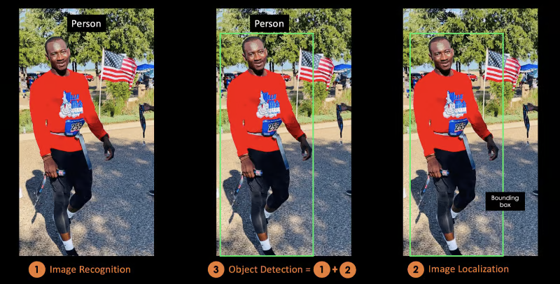
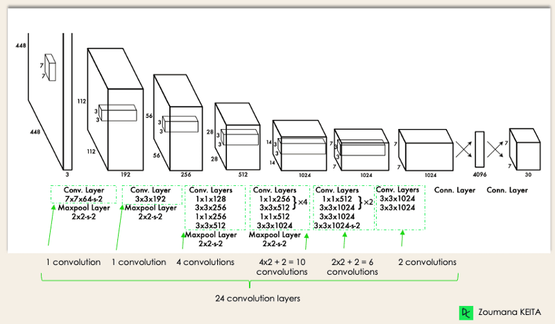

### Motivation

Within the field of professional sports, the usage of analytics to understand tactics and player performance has, in recent times, become increasingly widespread. Famously, the movie Moneyball, which was inspired by a real-life story, utilized **sabermetrics** to conduct empirical analysis of baseball games. The utilization of these so-called sabermetrics later inspired the application of more sophisticated techniques utilizing machine learning and AI for detailed performance metrics and measurements. While baseball pioneered these techniques, similar approaches have also been explored in other sports such as basketball. Each sport comes with its own challenges. In basketball, there is continuous player movement and complex interaction between the different players from both teams.

Moreover, these systems are often expensive, proprietary, or not publicly available, limiting access for smaller teams with smaller budgets or sports enthusiasts wanting to conduct their own research as a hobby.

This project aims to apply computer vision techniques to basketball games. Similar to baseball, basketball is both dynamic and continuous in nature. Applying the task of computer vision to this field can prove quite rewarding, offering rich and complex data to infer analytics from. Currently, the NBA utilizes statistics gathered by SportVU, which is a camera system that collects and provides real-time statistics such as player and ball positioning. The problem with this system is that it is both expensive and proprietary.

More specifically, we aim to automatically detect and track player as well as ball movement, with the intent of extracting actionable metrics from game footage. These metrics could include speed, positioning, ball possession, movement patterns and other performance indicators, providing a structure for a deeper tactical analysis.

Ultimately, the aim is to leverage readily available footage and accessible computer vision technology in order to infer analytics; these analytics should be efficiently available to hobbyists and smaller organizations without needing expensive, proprietary systems.

### Pre-trained Models
**Object Detection Model**: YOLOv11 (You-Only-Look-Once) [YOLO-LINK](https://github.com/ultralytics/ultralytics). Its a although initially published in 2015, through persistent versioning of the model, it has retained its position as a state-of-the-art model. Its core strengths are its *speed*, *detection accuracy*, *good generalization*, and that its *open-source*. Each versioning of YOLO attempts to improve on the previous, be it better handling of edge cases, quicker object detection or higher accuracy.



The Object Detection task consists of two primary objectives, image recognition and image localization. Image recognition asserts whether or not there is an object of a specified type (e.g., Person) in the image. Image localization places a bounding box around the type (e..g, the Person). 



The architecture above is illustrative of the original implementation of YOLO (its backbone) ([ORIGINAL PAPER](https://arxiv.org/pdf/1506.02640)). The image is first resized into a shape of 448x448, then it goes through subsequent convolutional layers. The activation function used throughout the network is the ReLU (recitified linear unit), expect in the final layer, which uses a linear activation function. In addition, regularization techniques are employed, e.g., dropout and batch normalization to prevent model overfitting.  

**Initially Challenges**:
- Do **ONLY** include persons of interest (e..g, Players and Basketball), i.e., not people from the public.
- Low frequency of basketball detection. The accuracy of basketball detection is initially low. 
- **Solution**: Fine-tune the YOLO model. Give it labeled examples to train on. We get a already trained model (transfer learning), but it does not know how to solve our current task.

### Dataset
...

### Authors (Equal Contribution)
1. Mahmut Osmanovic
2. Isac Paulssson
3. Sebastian Tuura

---

To view a team member from our Git configuration, run:

```bash
git config --file .gitconfig --get team.member1
