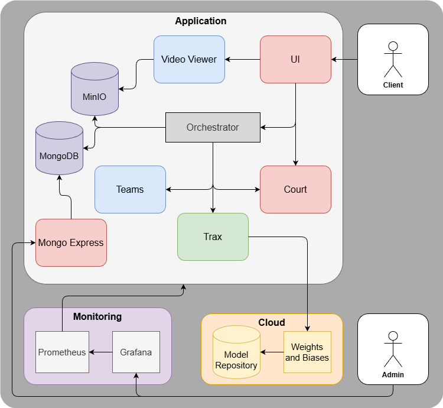

## Motivation
Within the field of professional sports, the usage of analytics to understand tactics and player performance has in recent times become increasingly widespread. Famously, the movie Moneyball (which was inspired by a real-life story), utilized sabermetrics to conduct empirical analysis of baseball games. The utilization of sabermetrics were subsequently overshadowed by the application of more sophisticated techniques, such as **machine learning** models. This project applies such techniques to basketball games.

Basketball is both dynamic and continuous in nature. Applying, for example, computer vision models to this field can prove quite rewarding, offering rich and complex data to infer analytics from.

Currently, the NBA utilizes statistics gathered by SportVU, which is a camera system that collects and provides real-time statistics such as player and ball positioning. These systems are often expensive, proprietary, or not publicly available, limiting access for smaller teams with smaller budgets or sports enthusiasts wanting to conduct their own research as a hobby.
 
Concretely, our aim is to automatically detect and track player as well as ball movement, with the intent of extracting actionable metrics from game footage. These metrics could include speed, positioning, ball possession, movement patterns and other performance indicators. The analytical results are to be without cost and immediately rendered available to its user, be it smaller organizations or hobbyists.
## General Operation
The application consists of a Docker Compose stack comprising 11 services. 
Six of these: detector_service, team_assigner_service, court-service, ui_service, video_viewer_service, and orchestrator_service, are custom-built components developed by us, each with its own Dockerfile and image created during the build process. Remaining services include, minio (file storage), mongodb (structured data), mongo-express (MongoDB dashboard), grafana (monitoring dashboard), prometheus (monitoring). The Compose stack orchestrates all 11 containers into a fully integrated application environment.

Running the application stack requires [docker](https://www.docker.com/) with cuda (13.0) support. The application stack can be built and launched using `./run.sh` from the root directory (note model registry access).  
The UI is divided into two workflows, one for creating reference courts for player positions. And the other for running inference on a basketball video.

### Court Creation User Flow
The court creation is performed as follows, first the user uploads a clip covering the baskeball court in a single sweep. From here a panorama of the court can be stitched using the button "Stitch Panorama". When the stitched panorama is complete, it is displayed in the right window for annotation. The user can now click the four corners of the court, name the court, and save the court for later use in analysis. If there is an input error during corner selection the user can click "Reset Points" to restore the selected points to the starting state. Detailed description of working principles and considerations for court stitching and inference is found in issue [#11](/../../issues/11). Bellow is an example use case:

https://github.com/user-attachments/assets/66a7d850-e0b4-4b11-8188-5cd7a95c44bb

### Basketball Analysis User Flow
To run inference on a video a court for the video must first be selected. The user can then upload a video for analysis, select the court in the dropdown. And finally run the analysis using the "Run Analysis" button. If the court does not appear in the dropdown it can be manually refreshed using the "Refresh Courts" Button. Bellow is an example use case:

https://github.com/user-attachments/assets/ad7bc2e4-9e86-4b0b-b05c-9120d3704e8f



The orchestrator manages the whole processing pipeline, sending and recieving API (through FastAPI) calls from services. 

**A comprehensive breakdown of orchestrator operation**: 
1. The finetuned production model for player and ball detections is found on the cloud, specifically in a model registry within weights and biases. It is amongst other reasons a cheaper option than self hosting, check [#13](/../../issues/13) for a more detailed breakdown. 
2. Subsequently the orchestrator sends the video path to the tracks detector service which returns player and ball tracks. These contain player and ball bounding boxes localizations for each player and ball object (identified by ByteTracker) across all frames.  
3. Additionally, the orchestrator sends the player tracks and the video to the team assigner service. The team assigner aggregates binned HSV color values within cropped bounding boxes per player. These are then clustered using K-Means for team assignment, detailed operation is described in PR [#41](/../../pull/41)
4. Ball acquisition run on the orchestrator service since its rule based and lightweight (i.e., does not justify a seperate service instance). It primarly utilizes to rules to check for ball position, the first being IoU and the second is based on closest distance between ball and players.
5. Thereafter, the homography matrices are calculated in the court service, which are utilized to yield accurate frame by frame updates on a minimap. The service provides homographies to reproject player coordinates for a top down view. Operation of the the court_service is found in the README which details API endpoints for creating reference images. Detailed description of working principles and previous work is found in issue [#11](/../../issues/11).
7. Within the orchestrator service, all yielded components are drawn a overlays and depicted on the original inputted video and a minimap video is created.
8. The created videos are uploaded to S3 for serving and statistics are written to MongoDB for storage. Statistics are also returned as JSON.
9. Finally, the ui service draws the plots and presents the videos in graphio.

## General System Outline
### Included capabilities:
- Top-down Player court position
- Statistics
  - Ball possession (team)
  - Passes (team)
  - Interceptions (team)
- Court spatial analysis
  - Court Team Controll
- Vizualize insights


### Used tools:
- Object Detection (Ultralytics YOLOv12)
- Experiment and Model Tracking (wandb)
- Model Registry (wandb)
- Id Tracking (Supervision ByteTrack)
- Homography (OpenCV SIFT, and SuperPoint + LightGlue)
- Containerization (Docker)
- API module (FastAPI)
- Monitoring (Prometheus, and grafana)
- Database (MongoDB for structured data storage)
- User Interface (gradio)

### Challenges:
- Only include persons of interest (e..g, Players and Basketball), i.e., not people from the public.
- Low frequency of basketball detection. The accuracy of basketball detection is low, likely due to the relatively small basketball size. 
- Team assignment, assign which player belong to what team.
- Ball possession, specify which team (or individual) is in possession of the ball.
- Passes/Interceptions, detect pass (same team) and interception (between teams).
- Attempted/Successful shots on hoop, detect and keep track of attempted shots on hoop and or scores by team (or individuals).
- Court homography, to go from broadcast view to top down view a projection is needed. Court is obstructed by players which can be difficult for SIFT or keypoint detection.
- Packaging statistics to provide a user friendly and insightful overview.

### Future possibilities:
- Statistics
  - Goals (Individual)
  - Attempted (Individual)
- Court spatial analysis
  - Ball position heatmap (difficult given single camera view)
- Player highlight reel
- Top-down Ball court position (difficult given single camera view)
- Live Analysis
  

## Pre-trained Models
Object Detection Model (baseline): [YOLOv12 (You-Only-Look-Once)](https://github.com/ultralytics/ultralytics). Although initially published in 2015, through persistent versioning of the model, it has retained its position as a state-of-the-art model. Its core strengths are its *speed*, *detection accuracy*, *good generalization*, and that its *open-source*. Each versioning of YOLO attempts to improve on the previous, be it better handling of edge cases, quicker object detection or higher accuracy. The choice of YOLO primarly boils down to its high performance coupled with its fast inference times. Other contendors included Detection Transformer (DETR) and the Segment-Anything-Models (SAM). DETR was not chosen since its performance was lower than YOLO12 (both in our testing and the testing of others), in addition to having longer inference times. SAM3 performed better than YOLO12, but its inference times were substantially longer, hence, not the most suitable given our scalability concerns. Posit users which require the processing of long basketball videos, the quicker the response, the better. 


## About YOLO
The Object Detection task, more generally, consists of two primary objectives, image recognition and image localization. Image recognition asserts whether or not there is an object of a specified type (e.g., Person) in the image. Image localization places a bounding box around the type (e..g, the Person).

The precice original implementation of YOLO is detailed in the [ORIGINAL PAPER](https://arxiv.org/pdf/1506.02640). The image is first resized into a shape of 448x448, then it goes through subsequent convolutional layers. The activation function used throughout the network is the ReLU (recitified linear unit), except in the final layer, which uses a linear activation function. In addition, regularization techniques are employed, e.g., dropout and batch normalization to prevent model overfitting.

## Experiment and Dataset
The finalized product is expected to be able to derive insights from various kinds of basketball input videos. Although, we put some constraints on it. NBA Broadcast style video is the expected input video format. The input video format is expected to be *.mp4*.

For object detection basketball players, the following dataset is used, [basketball players](https://universe.roboflow.com/workspace-5ujvu/basketball-players-fy4c2-vfsuv). The dataset contains 320 annotated images with classes: Ball, Player, Referee, Clock, Hoop, Overlay and Scoreboard. The dataset can be used to fine tune a object detection model to ignore the spectators. 

Nonetheless, we noticed that it had subpar performance on detecting the ball. Hence, we fine-tuned a smaller YOLO model on a larger dataset with approximately 14000 images, increasing ball mAP50 from 80 to 92% ([ball dataset](https://universe.roboflow.com/asas-annotations/ai-sports-analytics-system/dataset/7)).

For court homography a detailed writeup on Keypoint pose detetion for court is found in issue [#11](/../../issues/11) the previously specified dataset is not used (~~[a dataset with court keypoints](https://universe.roboflow.com/fyp-3bwmg/reloc2-den7l)~~). The issue also contains details on the current model and approach. The base of the current implementation is to build a panorama from video. This panorama image is used to create a reference image for keypoint extraction and matching with SuperPoint and LightGlue respectively.

Current experiment tracking is implemented using Weights and Biases (access to WANDB requires an invited by us). Progress and considerations are detailed in issue [#13](/../../issues/13). The application is containerized, everything needed to run it (except cloud access) is detailed. The model is kept as an artifact and linked to the model registry with tag @production. It is always retrieved from the model repository on application start-up, ensuring that users always have the current production model. The dataset is liekwise versioned kept in artifact storage. This facilitates in tracking which model that was trained on what data. Again, to access the production model from the model registry please reach out to us.

## Model Registry and Experiment Tracking
Fine tuning experiments are tracked using weights and biases, statistics are logged for each training run:


Models are linked to a model registry and tagged with `@production` for easy access. The service fetches the model from registry on startup. This ensures that the service always has the latest model:


## Monitoring
The monitoring of the four core services: *court*, *detector*, *team assigner* and the *orchestrator*. The monitored metrics are:
  1. API Call **Count** to each of the Services
  2. **Lastest Latency** for each of the API calls
  3. **Average Latency** for each of the API calls

The tools used for monitoring are Prometheus and Grafana. Prometheus scrapes (every 5 seconds) specified POST-API-endpoints within the services for data. The collected data, in this case, api call count and latency of requests, are accessed by Grafana from the Prometheus datasource. Grafana subsequently displays the accessed data in dashboards. Both the datasource and dashboard UI are setup during application start up. Corresponding code files may be accessed under the `monitoring` folder. Read [#43](https://github.com/mosmar99/Basketball-Tracker/pull/43#issue-3708105679).


## Tests
There are five tests designed to test the functionality of the application. The `tests` subfolder contains a *main.py* which will install if not previously installed the python module pytest and subsequently run the tests contained within the folder. 

To run all tests:
```py
    # From project dir
    python tests/main.py
```

To run a specific test:
```py
    # From project dir
    python -m tests.TESTNAME
    # where test name is the name of the specific file.
```

- `test_a_connectivity.py`: checks the statuses of the services by the new ping endpoint.
- `test_b_video_pipeline.py`: takes the small video, and uploads it to the miniobucket, then does the entire processing including minimap, team_assignment, tracks, drawing etc.
- `test_end_to_end_panorama.py`: takes the same video again and firstly stitches and then wraps it.
- `test_mongodb.py`: similarly to the test_a_connectivity.py test it checks whether we are able to connect, this time to mongodb
- `test_z_cleanup.py`: tests delete operations in all the buckets, except one specific for figures in minio. Deleting everything created in the previous tests, acting as a cleanup in the process.


## Improvements and Reflections

In the end we managed to surpass many of our initial expectations, although others proved more challenging. An well performing player and ball detection model, top-down view containing frame-by-frame court spatial analysis, player team assigner, passes/interceptions was implemented. Moreover, application was properly packaged with Docker, API endpoints established with FastAPI, minIO S3 bucket utilized for local video storage, mongoDB for metric storage of stuctural data (enabling figure reproductions), and monitoring tools Prometheus and Grafana. The general output is a self-contained basketball analytics application with great potential. That potential may be achieved by future refinements of the project if the below listed challenges are adressed. 

### Id Tracking
Id tracking on the basketball court using standard implementations is not robust and prone to id switching. Our specific case has some important constraints that could likely be considered for a custom implementation. First, there are at most 10 players on the court. Secondly, The players from the two teams are visually distinct, something that is alredy used for team assignment. Thirdly, players generally have pre-decided playing positions on the court. Finally, we have access to actual player position on the court. By incorporating these features into a custom tracking algorithm, we clould likely make major improvements to the reliabilty of the tracker for this specific use case.


### Player and Ball Detection
Creating diverse and highly accurate datasets for ball and player tracking could yeild an improvement to tracking performance and generalization. For players, more instances of player-player occlusion and clustering would be interesting. For the ball, more instances of fast ball movement and occlusion would likely improve performance. Additionally, better representation of varying courts and teams in the dataset could improve generalization. And as always, quantity of qualitative instances would likely help. In cases of high clustering and overlap the YOLO model has a drawback in non-maximum suppression (NMS), which filters bouning boxes within class based on overlap and confidence. This is done to remove multiple classifications of the same object. However, in the highly clustered case, actual object instances can be erroneously supressed.

### Ball Acquisition
The ball-acquisition functionality is decent but there requires improvements to function ideally. Specifically, if a ball simply goes too close by an opposing player without them "acquiring" the ball, current logic will in cases trigger ball interception although none occured. We posit two potential solutions, one includes estimating the speed of players and the ball, for isntance, if opposing enemy players are standing still, but the ball is moving past them in a pass, that should not be counted as an interception. Secondly, if one has several camera angles it gives the possibility of accurately determining player and ball positions in 3D space, rendering the IoU between player and ball more meaningful and precise. Additionally improvement could include measuring IoU between the ball and player hands, however, that would require and another dataset. 

### Court Creation Automation
Annotation of court panoramas to create reference images for homography is currently done manually by the user. This presents a unique oppurtunity to automate the task. In a live case, images and annotations could be saved to create a dataset for training a keypoint model on the specific use case. This could be done as a three step process. First gather a sufficient amount of data for initial model training. Secondly, use a trained model to give suggestions of keypoint placement. Finally, when the model is performing adequately, fully automate the flow with the option of a fallback to suggestion on low prediction confidence.

### Court Stitching
Regarding court homography, an alternative approach could be implemented utilizing a global feature mapping. Keypoints and descriptors should be generated for each image, using a single image as an initial reference. Subsequently, attempts to match all other images to this reference should be performed. Any image with a strong match to the global reference should have its features mapped into the global reference to aid subsequent matchings. This solution would be more robust to the accumulation of small errors, as images are matched to global features rather than just the previous frame. This would also allow for random sampling from the video. However, it would come at a cost to performance, as failed matches may need to be reattempted if sufficient descriptors do not yet exist in the global map.

## Takeaways
There are many takeaways we bring us from this project. The project has exposed us to `State-of-the-Art` Computer Vision techniques (YOLO, SAM, RF-DETR, SUPER-POINT, LIGHT-GLUE, BYTETRACK, BOT-SORT, etcetera), their PROs and CONs and usage. Moreover, we have been able to utilize a variety of relevant `MLOps tools`, including Grafana and Prometheus, enabling live monitoring of our application, an important feature for debugging and ensuring application reliability. The project has forced us to think critically about implementation choices, justifying our decisions and think about their longterm consequences. Long term consequences include the scalability, reliability and user-friendliness of our application.

## Authors (Equal Contribution)
1. Mahmut Osmanovic
2. Isac Paulssson
3. Sebastian Tuura

---

To view a team member from our Git configuration, run:

```bash
git config --file .gitconfig --get team.member1
